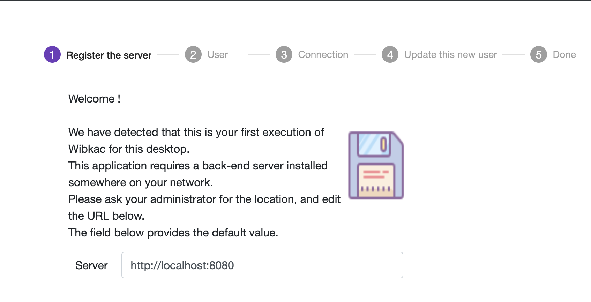

= fitzhì
Author <frederic.vidal@fitzhi.com>
v0.1, 2019-04-10
:toc:

fitzhì is an open-source skills management project, initially developed for software companies (first tests are executed inside an IT service centers). 
You are allow to alter the scope of fitzhì, but key features wont not relevant without IT projects.

fitzhì is declared under the MIT License +
Therefore, you are absolutely free to fork, enhance and update this present application. 
You are also very welcomed to get involved in the project. *We look for contributors to enhance fitzhì*.

This first release of fitzhì has been developed with a front-end in Angular and a back-end server in Java(TM) / Spring Boot(C). +
No database is required. All data are stored in JSON files, located on the file system. 
A periodic saving procedure can be scheduled to push these files on a Git repository. 
No complex administration is needed. We intend to design the most-easy-to-use-and-deploy application.
fitzhì is a light solution. It has been designed in that way,  because of the low volume of information. 
If you company has more than 1 millions of employees, this product is not for you.

fitzhì is also very tied to the version control software GIT(TM). +
Some of the features are very connected to this repository. 
We still dream/plan to implement other releases for SVN(TM), Microsoft's TFS... Once again, contributors are welcome. +
_Lazy people might be productive people :_ 
We try to avoid the double entry of information so, as often as possible, the tool will strive to extract information from the repository.

== MAIN FEATURES

.The main features of fitzhì are

* The Staff management

** You will be able to register everyone from the staff, and more specifically developers.
** You will be able to attribute them skills, and a level for each one (e.g. java expert). 
(_An evaluation process, involving the collaborators and his pairs, is available._) 
Skills can be easily extracted from the applications files if you upload them. 
** You can involve your collaborators into projects. 
One again, a list of projects proposals will be presented, based on repositories. 

* Project management

** You will be able to register all projects active in the company.
** Skills required for the project can be registered. Some will be inferred from the source control.
** The complete list of contributors in projects are previewed in a dedicated list.
** A risk management dashboard from the point of view of teams and available skills is also available in fitzhì.

* Skills management

** You will be able to register all skills. A predefined IT list is proposed. 
** You will be able to follow up the the variation of the global level of developers by technologies. 

== INSTALLATION

First of all, you will need to export the GitHub repository.

. Download fitzhì
[source, shell]
---
git clone https://github.com/frvidal/fitzhì.git
rm -rf .git
---

A directory fitzhì will be downloaded with this content :

* front-fitzhì (the Angular front-end project)
* back-fitzhì  (the Spring back-end project)

=== BACK-END INSTALLATION

fitzhì has the following prerequisites:::
* Java 8 or higher
* Maven 3 or higher
* Git 2 or higher installed on the back-end server

The installation of the back-end is very simple. Just type :

[source, shell]
----
cd fitzhì
./init.sh
----

|===
|Directory |Version
|deploy
|Main deployment directory
|deploy/backend-fitzhì
|the directory of the executable fitzhì.jar
|deploy/data
|the data directories used by fitzhì
|deploy/data/application
|the data directories where your corporate data will be stored (e.g. staff.json, project.json & skill.json). 
All of your updates will be stored there.
|deploy/data/referential
|the referential data which contains the static data used by the application
|===

You can copy the deploy directory on a remote server, or leave it, on your machine, for testing purpose.
The back-end URL, therefore, will be http://localhost:8080 

To start the back-end fitzhì, just type:
[source, shell]
----
deploy/backend-fitzhì/fitzhì.jar 
----

To test if the server is started, just visit the url http://localhost:8080/ping , or http://<<hostname>>:8080/ping  
 

=== FRONT-END INSTALLATION

The easiest installation involved no-installation. +
The last stable release of front-fitzhì is available here https://frvidal.github.io/fitzhì/ . +
This URL hosts only a static web server which delivers JS files. So just go there.

If you prefer to deploy the front-end on-premise, like any other Angular application. +
Just type 
[source, shell]
----
cd front-fitzhì
ng build --prod 
----

A *dist* (by default) directory will be created. +
Just copy everything within the output folder to a folder on your server.
For more precision, just RTFM, https://angular.io/guide/deployment

 
== FIRST LAUNCH OF fitzhì

The common sense might consider that there only can be one first launch. 
In fact, *two* are available with Lombok : the first launch and the *very* first launch. +

=== THE VERY FIRST LAUNCH
The first user of Lombok will the first administrative user. +

 